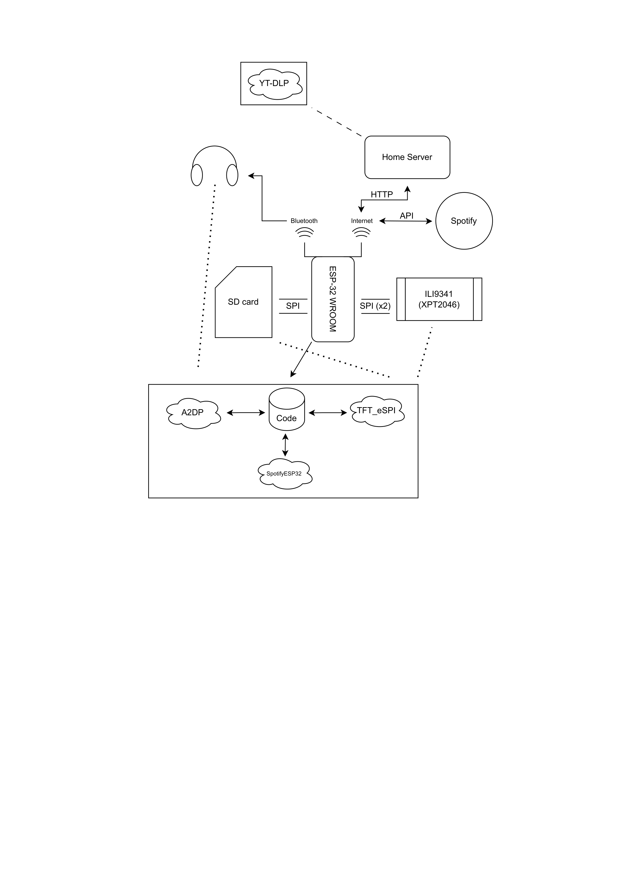
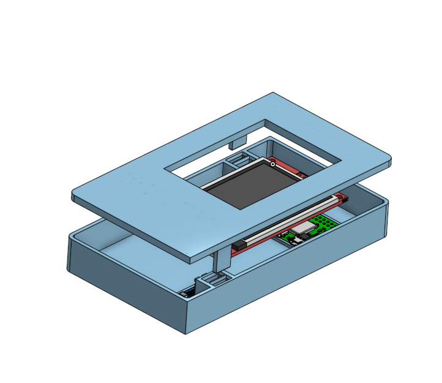

# FAQ

**What the hell is Spotiman?**

Spotiman is a device designed by two students that were sick of modern music industry where listening to music feels like doomscrolling. We just wanted to hit play and enjoy.

**How does it work?**

It uses TFT screen that displays Menu, player, playlists and settings also. It connects to your spotify account via Spotify API. You can import your playlist and listen with wired or bluetooth headphones. You can control Spotiman with rotary encoder. The heart of Spotiman creates ESP-32 WROOM. Your music will be saved on SD card so you can listen and manage it even if you are in the middle of Sahara. However only for now you need to use home server for downloading. But we are planning to also use an API for that.

**Wow, how did you design Spotiman?**

We used a couple of tools such as
- Onshape for CAD
- Lopaka for UI design
- Our own brains, AI + lot of tutorials for firmware
- Wokwi for testing ideas.

**Spotiman is still in development. Feel free to contribute**

## Images

 
